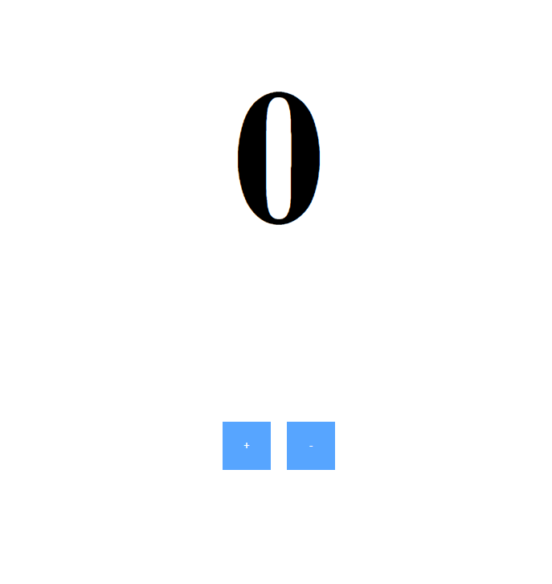

This project was created in my first coding live stream on [Twitch](https://www.twitch.tv/micaelr951).

This is just an counter app made with React and Redux to teach chat. The app has 2 buttons to increment and decrement a value.

## To run the project

### `npm start`
